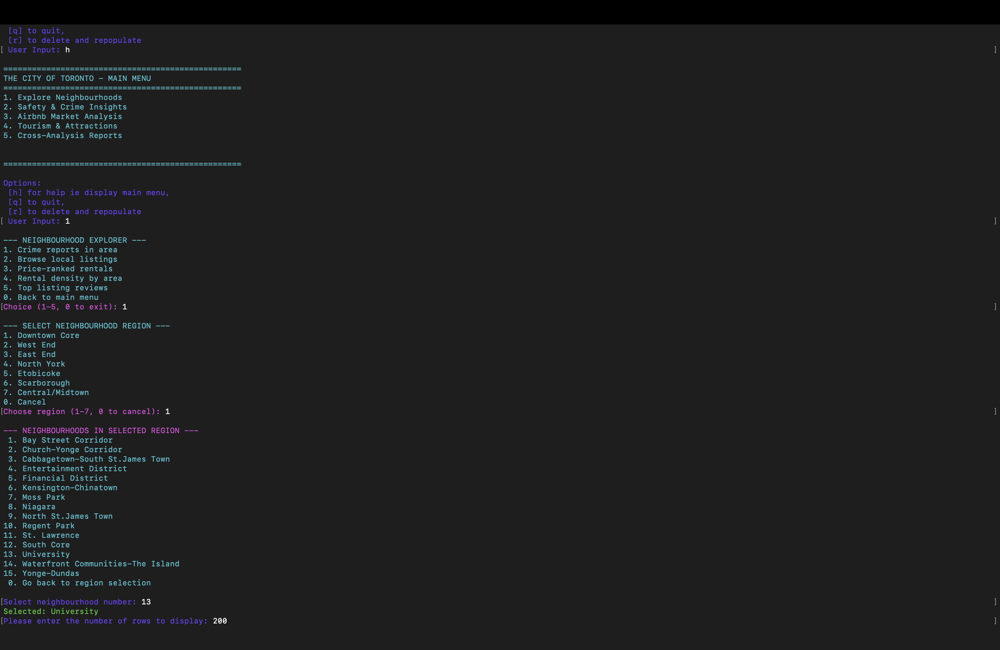
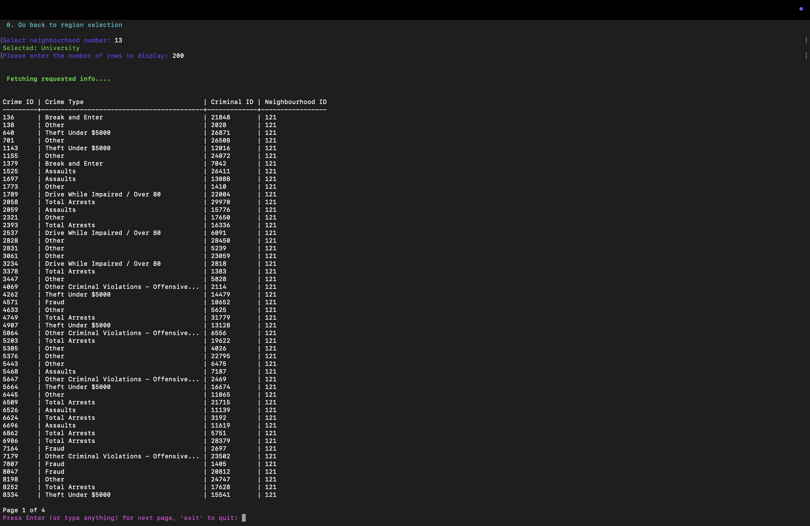
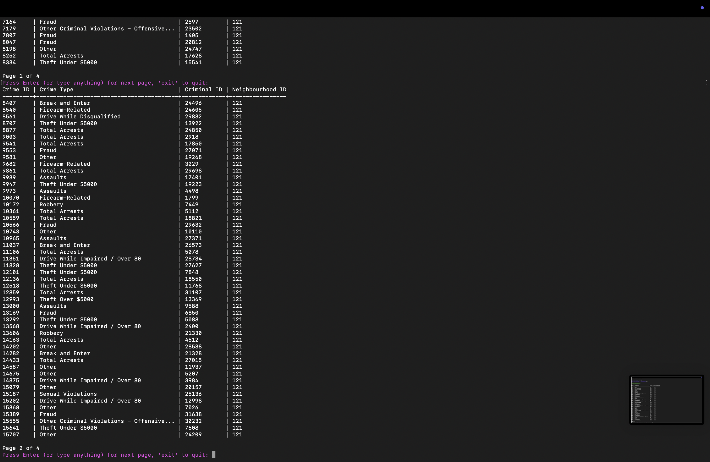
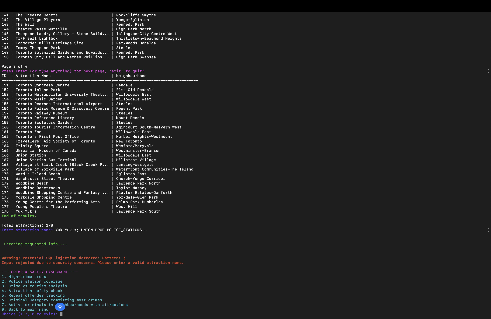

# Toronto Urban Analytics Database System

This project is a database-driven analytics system built using publicly available Toronto open datasets. It integrates multiple sources of urban data into a normalized relational database and provides a Java based command line interface for querying and analysis.

The project was developed as part of a database systems course and emphasises database design, data cleaning, query complexity, and secure database interaction. Rather than focusing on a graphical user interface, the project prioritizes correctness, robustness, and analytical usefulness of the database itself.

---

## Project Motivation

Urban data is often fragmented across independent sources and published in formats that are not immediately suitable for analysis. Before meaningful insights can be extracted, the data must be cleaned, standardized, and structured in a way that supports complex queries.

The goal of this project was to simulate a real-world data engineering and analytics workflow by:
- Selecting multiple related public datasets
- Cleaning and preprocessing the data programmatically
- Designing a relational database that captures meaningful relationships
- Allowing an analyst to safely run interesting and non-trivial queries

---

## Datasets Used

This project integrates several Toronto open datasets, including:

- Airbnb listings containing pricing, availability, room type, and location information
- Crime data containing offense categories and geographic locations
- Attractions representing tourist and cultural points of interest
- Amenities such as restaurants, transit stops, and public services
- Police stations representing law enforcement coverage

Each dataset was originally provided as raw CSV files and required preprocessing before being inserted into the database.

---

## Data Cleaning and Preprocessing

Before loading the data into the database, a preprocessing and ETL pipeline was implemented in Python using Pandas.

Pandas was chosen because it allows large datasets to be cleaned programmatically and reproducibly, which mirrors how real world data engineering pipelines are built.

The cleaning process included:
- Removing duplicate and incomplete records
- Standardising attribute formats across datasets
- Converting data types to match relational schema requirements
- Resolving inconsistent categorical values
- Preparing data for foreign key relationships

Only cleaned and validated data was inserted into the database.

---

## Database Design

The database schema was derived from an ER model and normalised to reduce redundancy and improve data integrity. The schema includes clearly defined primary keys and foreign keys that represent relationships between listings, crimes, amenities, attractions, and police coverage.

The design supports:
- Cross-dataset joins
- Aggregate queries using COUNT and AVG
- GROUP BY and ORDER BY queries
- Parameterised queries for analyst-driven exploration

The schema was designed to ensure that all tables are accessible through the interface, either directly or indirectly.

---

## System Architecture

Raw CSV Datasets
      |
      v
Python Data Cleaning and ETL (Pandas)
      |
      v
SQL Server Relational Database
      |
      v
Java Command Line Interface

## Screenshots

The screenshots below show the Java-based command-line interface in use. They illustrate how an analyst interacts with the system, selects analytical queries, and views formatted results produced by the database.

### Main Menu

This screenshot shows the main menu displayed when the application starts. The menu provides a structured way for the user to select predefined analytical queries and ensures controlled interaction with the database.

### Query Output Example

This screenshot shows the output of an example analytical query. Results are presented in a tabular format with clear column headings and logical ordering to make them easy to interpret.

### Paginated Results

This screenshot demonstrates pagination for queries that return a large number of rows. Pagination prevents results from scrolling out of view and improves usability when working with larger datasets.

### SQL Injection Protection

This screenshot demonstrates that the application is robust against SQL injection attempts. User input is not executed as raw SQL. Instead, the interface uses parameterized queries through Java PreparedStatements, so malicious input is treated as plain text and does not alter the intended query.

